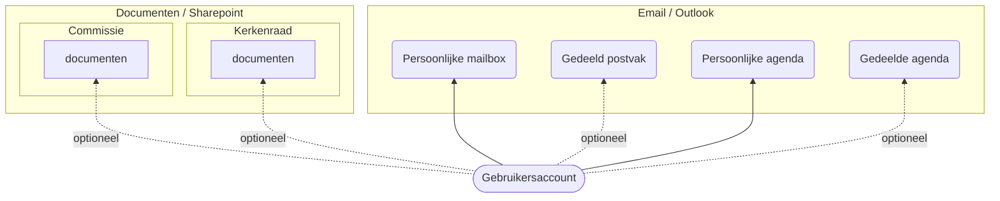

## Persoonlijk account

Voor het gebruik van de verschillende diensten van Microsoft 365 is een **persoonlijk** account nodig.
De beheerder maakt een persoonlijk account aan, u krijgt die gegeven toegestuurd door Microsoft.
In die email vindt u ook een wachtwoord. Dat wachtwoord is tijdelijk, zodra u de eerste keer inlogt, dan moet u een 
nieuw wachtwoord opgeven. Dat nieuwe wachtwoord moet in het vervolg gebruiken.

Met behulp van uw account kunt u inloggen op bijvoorbeeld [https://portal.hervormdputten.nl](https://portal.hervormdputten.nl). Meer informatie over het portaal is [hier](../portal) te vinden. 

{}
Deel **nooit** het wachtwoord met iemand anders. Als beheerder zullen we uw wachtwoord ook niet vragen.
Als andere gemeenteleden toegang nodig hebben tot email of documenten, dan is het mogelijk dat zij ook zelf een account
krijgen en op basis daarvan kunnen zij dan ook toegang krijgen. **Uw account is strict persoonlijk**.
{}

## Diensten 

Op basis van uw persoonlijk account zijn allerlei diensten te gebruiken zoals email en het delen van documenten.   
Op andere pagina's is informatie over de verschillende diensten te vinden.

De onderdelen:
* [Email](../email)
* [Documenten](../documenten)
* [Agenda](../agenda)

Alles is bereikbaar vanuit het [portaal](../portal)

## Wachtwoord vergeten?

Als u uw wachtwoord niet meer weet, dan kunt u 
[https://passwordreset.microsoftonline.com/](https://passwordreset.microsoftonline.com/) bezoeken en de stappen volgen.
De beheerder ontvangt dan bericht om u te helpen met de reset.

## Wachtwoord wijzigen
U kunt zelf uw wachtwoord op elk moment wijzigen. Het kan door het bezoeken van [https://myaccount.microsoft.com/](https://myaccount.microsoft.com/).    
Aan de linkerkant in het menu kunt u kiezen voor 'Wachtwoord' om daarna het wachtwoord te wijzigen.    