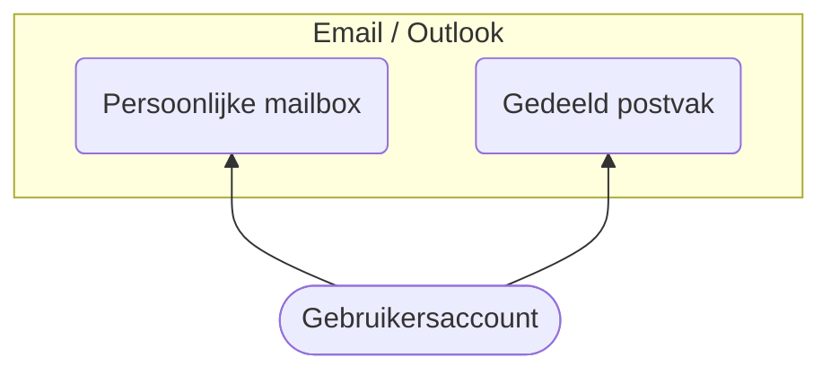

## Wat is een gedeeld postvak

Iedere gebruiker krijgt een **persoonlijk** account, met bijbehorende persoonlijke mailbox.    
Daarnaast wordt voor een **functie/ambt** een **gedeeld postvak** aangemaakt. Degene die de functie bekleed, krijgt
toegang. Bij overdracht is het mogelijk dat tijdelijk 2 personen toegang hebben, maar na verloop van tijd worden de
rechten van de eerste persoon ingetrokken. Daarnaast kan een gedeeld postvak aangemaakt worden voor een commissie of
werkgroep, waarbij meerdere personen toegang hebben tot dat gedeeld postvak.

Voorbeelden van een gedeeld postvak:

* ak@hervormdputten.nl   
  _Alleen de scriba_ van de algemene kerkenraad heeft toegang.
* scribawijk1@hervormdputten.nl   
  _Alleen de scriba_ van wijk 1 heeft toegang.
* kerktijd@hervormdputten.nl    
  De mensen die de uitnodigingen voor de kerkdiensten regelen, hebben toegang. Dit zijn dus _meerdere personen_.

De toegang tot een gedeeld postvak verloopt iets anders dan een persoonlijk account.   
Verdere functionaliteit is hetzelfde.

## Toegang vanaf mobiel/tablet met de Outlook app

De Outlook app is een **goede app** die voorbereid is op het gebruik van een gedeeld postvak.   
Uit ervaring blijkt dat de standaard email app van iOS en Android hier niet op is voorbereid.

* [Outlook app voor iOS/Apple](https://apps.apple.com/us/app/microsoft-outlook/id951937596)
* [Outlook app voor Android](https://play.google.com/store/apps/details?id=com.microsoft.office.outlook)

Bij het instellen van de app is het nodig om **eerst** het **persoonlijk account** te koppelen.   
Bij het starten van de app zal de app vragen om een gebruikersnaam, dat is uw @hervormdputten.nl gebruikersnaam en dan
het bijbehorend wachtwoord. De rest wijst voor zich.

Daarna kan u een gedeeld postvak toevoegen, dit kan door stappen te volgen zoals die beschreven zijn op
[deze pagina](https://support.microsoft.com/nl-nl/office/een-gedeeld-postvak-toevoegen-aan-outlook-mobile-f866242c-81b2-472e-8776-6c49c5473c9f?ui=nl-NL&rs=nl-NL&ad=NL)

In de app kunt u emails ontvangen en versturen vanuit het gedeeld postvak.

## Toegang vanuit Outlook (webversie)

Vanuit het [portaal](../portal) kan u meteen door klikken naar de webversie van Outlook (https://outlook.office.com/).    
In het portaal kunt u ook zoeken naar het gedeelde postvak en dan rechtstreeks het postvak openen.

Microsoft heeft
een [uitgebreide pagina met informatie](https://support.microsoft.com/nl-nl/office/een-gedeeld-postvak-openen-en-gebruiken-in-de-webversie-van-outlook-98b5a90d-4e38-415d-a030-f09a4cd28207?ui=nl-NL&rs=nl-NL&ad=NL
) over het gebruik van een gedeeld postvak. Op die pagina staat hoe het postvak is toe te voegen aan uw Outlook pagina
en ook hoe versturen vanuit postvak werkt.

{}    
Bekijk goed het deel over het **versturen van emails** vanuit een gedeeld postvak, op de pagina van Microsoft hierboven
genoemd en de instellingen hieronder, anders kan het zijn dat u vanuit uw persoonlijk account verstuurt.    
{}

#### Van-veld

Het `van` veld kan zichtbaar gemaakt worden en kan dan gebruikt worden om de afzender te bepalen.    
De allereerste keer zou het adres van het gedeeld postvak nog niet zichtbaar zijn, die kan u dan toevoegen door op de
knop `van` te klikken en het toe te voegen.    
    
'Van' veld weergeven    


In de instelling van Outlook is het ook mogelijk om het `van` veld standaard weer te geven, daarmee is makkelijker te
versturen van af een gedeeld postvak.
   
Instellingen van Outlook    


### Directe toegang tot een gedeeld postvak

Naast de mogelijkheid om het gedeelde postvak rechtstreeks te openen. Dit is een voorbeeld:    
https://outlook.office.com/mail/kerktijd@hervormdputten.nl/inbox   
In de link hierboven is het voorbeeld emailadres `kerktijd@hervormdputten.nl` gebruikt, die kan aangepast worden naar
het emailadres wat u wilt openen.

De directe link naar het gedeelde postvak kan u opslaan in uw favorieten, dan kan u het altijd snel openen.

## Toegang vanuit Outlook (op computer/laptop)

Voor degene die Outlook op hun computer hebben, is er ook een manier op een gedeeld postvak in Outlook te openen. Hier
heeft Microsoft
een [uitgebreide pagina](https://support.microsoft.com/nl-nl/office/een-gedeeld-postvak-openen-en-gebruiken-in-outlook-d94a8e9e-21f1-4240-808b-de9c9c088afd?ui=nl-NL&rs=nl-NL&ad=NL)
over gemaakt. Als Hervormde Gemeente hebben we geen licentie voor Outlook, dus we kunnen Outlook niet verstrekken als u dat nog niet heeft.

#### Oudere versies van Outlook

Microsoft heeft IMAP en SMTP met basic authentication stop gezet. Alleen moderne authenticatie werkt.    
Oudere Outlook versies ondersteunen dit standaard niet, maar er zijn manier om dat wel voor elkaar te krijgen.   
Dat heeft Microsoft hier beschreven: [Activeer moderne authenticatie](https://learn.microsoft.com/nl-nl/microsoft-365/admin/security-and-compliance/enable-modern-authentication?view=o365-worldwide)

#### App voor Windows 10/11

Een **goed alternatief** is de [Office app voor Windows 10](https://www.microsoft.com/nl-nl/p/office/9wzdncrd29v9?rtc=1&activetab=pivot:overviewtab).
Met behulp van deze app is het mogelijk om snel toegang te krijgen tot email en documenten, en andere online mogelijkheden die behoren bij een @hervormputten.nl account.      
Email wordt niet geopend in deze app, maar opent een tabblad in de browser met toegang tot Outlook (inloggen kan dan nog wel nodig zijn). Hetzelfde geldt voor documenten, zeker als we ook overstappen op Sharepoint voor documenten delen.

## Overige email programma's

Veel email programma's kunnen tegenwoordig overweg met online Outlook account. Het gebruik van een gedeeld postvak kan iets anders liggen, mogelijk werkt dat niet.    
Als het email programma het niet ondersteund, dan adviseren we de Outlook webversie te gebruiken, zoals hierboven genoemd is.

