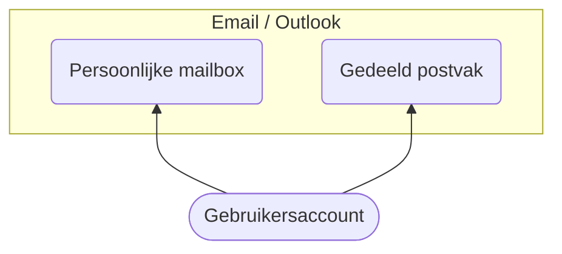

## Uitleg

In het verleden hadden we alle emailadressen ...@hervormdputten.nl bij Solcon. Nu gaan we alle emailadressen overzetten
naar Microsoft 365. De emailadressen die we aanmaakten bij Solcon waren steeds emailadressen die horen bij een
functie/ambt binnen de kerk. Een gemeentelid bekleedt die functie voor een bepaalde tijd en dan neemt iemand anders die
functie over. Zo'n wisseling vraagt ook altijd het overdragen van de bijhorende mailbox inclusief wachtwoord. Het
wachtwoord wordt vaak genoeg niet aangepast, daarmee zou de voorganger ook nog toegang kunnen houden. In de nieuwe
structuur krijgt iedereen een **persoonlijk account**, met bijbehorende persoonlijke mailbox. Daarnaast word voor een
functie een gedeeld postvak aangemaakt. Degene die de functie bekleed, krijgt toegang. Bij overdracht is het mogelijk
dat tijdelijk 2 personen toegang hebben, maar na verloop van tijd worden de rechten van de eerste persoon ingetrokken.

De reden om het op deze manier te doen is dat er geen wachtwoorden worden overgedragen en als iemand een andere functie
krijgt binnen onze gemeente blijft de toegang hetzelfde met hetzelfde account. We hebben met OwnCloud ervaring opgedaan
met deze manier van werken, en dat werkt er fijn. Het geeft ons ook precies inzicht in wie toegang heeft tot welk
account.

## Stappenplan

Hieronder is een stappenplan beschreven hoe we de migratie per emailadres gaan doen. Als er vragen zijn, dan kan er
altijd een email gestuurd worden naar ithelp@hervormdputten.nl

1. Een [persoonlijk account](../../account) wordt aangemaakt, dit is een emailadres als <voornaam>.<achternaam>
   @hervormdputten.nl.    
   Accountgegevens worden automatisch toegestuurd naar het opgegeven prive emailadres. Controleer of
   de [toegang](../toegang) werkt.
1. Een [gedeeld postvak](../gedeeldpostvak) wordt aangemaakt.
1. Automatisch doorsturen wordt ingesteld van Solcon naar het nieuwe gedeelde postvak.
1. Emails in de mailbox bij Solcon worden gemigreerd naar het nieuwe gedeelde postvak.
1. Migratie is voltooid, controleer nu ook of het werkt en verstuur een bericht vanuit
   het gedeeld postvak naar je prive emailadres.  
1. Het emailadres bij Solcon wordt later weggehaald.

      